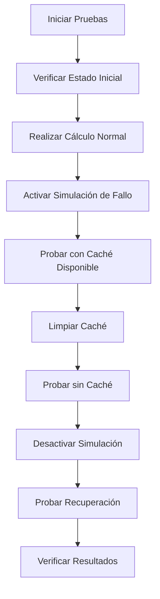

# 🧪 Guía de Pruebas de Fallo del Servicio Externo

## 📝 Descripción

Esta guía explica cómo usar las colecciones de Postman para probar el `ExternalServiceFailureSimulator` y validar el comportamiento del sistema cuando el servicio externo de porcentajes falla.

## 📁 Colecciones Disponibles

### 1. **Spring-Java-Token-Labs-API.postman_collection.json**
- Colección principal con todos los endpoints
- Incluye carpeta "External Service Failure Tests" con casos específicos
- Tests básicos de fallo del servicio externo

### 2. **External-Service-Failure-Tests.postman_collection.json**
- Colección especializada para pruebas de fallo
- Organizada por escenarios de prueba
- Tests avanzados con validaciones específicas

## 🎯 Escenarios de Prueba

### **Escenario 1: Servicio Funcionando Normalmente**
```bash
# 1. Verificar estado inicial
GET /test/failure-status

# 2. Realizar cálculo
POST /calculate
{
  "firstNumber": 10.0,
  "secondNumber": 20.0
}

# Resultado esperado:
# - Status: 200
# - Percentage: 15.75
# - Result: 34.73
```

### **Escenario 2: Servicio Fallando con Caché Disponible**
```bash
# 1. Activar simulación de fallo
POST /test/simulate-failure

# 2. Realizar cálculo (debería usar caché)
POST /calculate
{
  "firstNumber": 5.0,
  "secondNumber": 15.0
}

# Resultado esperado:
# - Status: 200
# - Percentage: 15.75 (del caché)
# - Result: 23.15
```

### **Escenario 3: Servicio Fallando sin Caché**
```bash
# 1. Limpiar caché
POST /test/cache-clear

# 2. Realizar cálculo (debería fallar)
POST /calculate
{
  "firstNumber": 3.0,
  "secondNumber": 7.0
}

# Resultado esperado:
# - Status: 500
# - Error: "Servicio externo no disponible y no hay valor en caché"
```

### **Escenario 4: Recuperación del Servicio**
```bash
# 1. Desactivar simulación de fallo
POST /test/disable-failure

# 2. Realizar cálculo (debería funcionar)
POST /calculate
{
  "firstNumber": 8.0,
  "secondNumber": 12.0
}

# Resultado esperado:
# - Status: 200
# - Percentage: 15.75
# - Result: 23.15
```

## 🔧 Endpoints de Control

### **Verificar Estado de Simulación**
```bash
GET /test/failure-status
```
**Respuesta:**
```json
{
  "status": "success",
  "failureSimulationActive": false,
  "message": "Simulación de fallo inactiva",
  "timestamp": "2025-10-21T19:23:14.887304"
}
```

### **Activar Simulación de Fallo**
```bash
POST /test/simulate-failure
```
**Respuesta:**
```json
{
  "status": "success",
  "message": "Simulación de fallo del servicio externo activada",
  "timestamp": "2025-10-21T19:01:57.766004"
}
```

### **Desactivar Simulación de Fallo**
```bash
POST /test/disable-failure
```
**Respuesta:**
```json
{
  "status": "success",
  "message": "Simulación de fallo del servicio externo desactivada",
  "timestamp": "2025-10-21T19:03:13.386084"
}
```

### **Limpiar Caché**
```bash
POST /test/cache-clear
```
**Respuesta:**
```json
{
  "status": "success",
  "message": "Caché de porcentajes limpiado exitosamente",
  "timestamp": "2025-10-21T19:02:29.12975"
}
```

## 🧪 Tests Automáticos Incluidos

### **Tests Básicos**
- ✅ Verificación de código de estado
- ✅ Verificación de tiempo de respuesta
- ✅ Verificación de Content-Type JSON

### **Tests Específicos de Fallo**
- ✅ Validación de estado de simulación
- ✅ Verificación de uso de caché
- ✅ Validación de mensajes de error
- ✅ Comparación de porcentajes entre llamadas

### **Tests de Escenarios**
- ✅ Servicio funcionando normalmente
- ✅ Fallback a caché cuando servicio falla
- ✅ Error cuando no hay caché disponible
- ✅ Recuperación del servicio

## 📊 Flujo de Pruebas Completo



## 🚀 Cómo Usar en Postman

### **Opción 1: Colección Principal**
1. Importa `Spring-Java-Token-Labs-API.postman_collection.json`
2. Navega a la carpeta "External Service Failure Tests"
3. Ejecuta los requests en orden secuencial

### **Opción 2: Colección Especializada**
1. Importa `External-Service-Failure-Tests.postman_collection.json`
2. Usa la carpeta "Complete Test Flow" para secuencia automática
3. O ejecuta escenarios individuales en "Failure Scenarios"

### **Opción 3: Runner de Postman**
1. Selecciona la colección "External Service Failure Tests"
2. Configura el entorno con `baseUrl`
3. Ejecuta toda la colección automáticamente

## 🔍 Validaciones Importantes

### **Comportamiento del Caché**
- **Con caché**: El porcentaje debe ser el mismo en todas las llamadas
- **Sin caché**: Debe devolver error 500
- **Recuperación**: Debe volver a funcionar normalmente

### **Logs del Servidor**
```bash
# Servicio funcionando
INFO - Servicio externo respondió correctamente con porcentaje: 15.75%

# Servicio fallando con caché
ERROR - Error al obtener porcentaje del servicio externo
INFO - Usando último valor almacenado en caché: 15.75%

# Servicio fallando sin caché
ERROR - Error al obtener porcentaje del servicio externo
ERROR - No hay valor en caché y el servicio externo falló
```

## 🐛 Troubleshooting

### **La simulación no se activa**
- Verifica que el endpoint `/test/simulate-failure` devuelva status 200
- Revisa los logs del servidor para confirmar activación

### **El caché no funciona**
- Verifica que Redis esté ejecutándose en puerto 26379
- Usa `/test/cache-clear` para limpiar caché manualmente

### **Los tests fallan**
- Asegúrate de que la aplicación esté ejecutándose
- Verifica que las variables de entorno estén configuradas
- Revisa los logs del servidor para errores

## 📈 Beneficios de las Pruebas

- **Validación de Resiliencia**: Confirma que el sistema maneja fallos correctamente
- **Verificación de Caché**: Asegura que el fallback funciona como se espera
- **Testing Automatizado**: Reduce tiempo de pruebas manuales
- **Documentación Viva**: Los tests sirven como documentación del comportamiento

## 🎯 Casos de Uso

### **Desarrollo**
- Validar implementación de manejo de fallos
- Probar comportamiento del caché
- Verificar recuperación del servicio

### **Testing**
- Ejecutar pruebas de integración
- Validar escenarios de fallo
- Confirmar comportamiento esperado

### **Producción**
- Monitorear comportamiento del sistema
- Verificar que el caché funciona correctamente
- Validar recuperación automática
